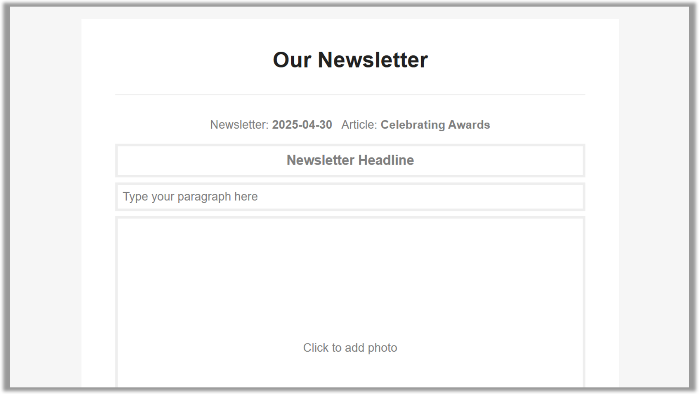

# Newsletter Builder

Newsletter Builder is a free, open-source web application that makes school newsletters a team effort. Easily invite contributors, streamline article creation, and publish vibrant newsletters.

### Features

* Easy-to-use, minimalistic interface
* Articles can be scheduled in advance and assigned to contributors
* Automated reminder emails to keep contributors on track
* Consistent, professional presentation of text and photos
* Photo consent confirmation
* AI-powered feedback on article content and style
* Quality assurance process for editors to check articles before publishing
* Upcoming event calendar included at the bottom of every newsletter
* Recipient management
* One-click publication by email and to a public website
* Single sign-on (SSO) using Microsoft 365

### Setup

1. Create a Postmark server.

2. Create a general purpose v2 storage account in Microsoft Azure.
    * Add private containers: `photos`, `dataprotection`
    * Within the `dataprotection` blob container, upload a blank file `keys.xml`. Generate a SAS URL for this file with read/write permissions and a distant expiry. This will be used to store the application's data protection keys so that auth cookies persist across app restarts.
    * Add tables: `articles`, `events`, `newsletters`, `recipients`, `users`
    * The `users` table needs an initial entry, and this must be a valid user on your Azure tenant:
        * PartitionKey - the email domain of the user (everything after the `@` symbol)
        * RowKey - the email name of the user (everything before the `@` symbol)
        * IsEditor - `true`
        * FirstName - the user's first name
        * DisplayName - the user's title and surname
    * Enable static website hosting, and set the index document to `index.html` and the error document to `404.html`. This will create a `$web` blob container, which will be the root of the public-facing newsletter website.
    * Customise the contents of the `StaticWebsite` folder in this repository, for example replacing placeholders with their appropriate values. Then upload to the `$web` blob container. Also upload `logo.jpg` (250x250px), `logo-hd.jpg` (1200x1200px), `favicon.ico`, and `icon-192x192.png`.
    * Enable CORS for blob `GET` requests from the domain where the newsletter builder will be hosted (e.g. `https://build.newsletter.example.com`).

3. Create an Azure CDN endpoint with the static website as its origin, and a custom domain set for where you would like your newsletter to be available online (e.g. `newsletter.example.com`). Enable compression. Add the following rules:
    * If request protocol = `HTTP` then URL redirect Found (302), HTTPS 
    * If URL file extension = `jpg`, `png`, `pdf`, `css`, or `js` (lowercase) then modify response header: overwrite `Cache-Control` `max-age=31536000`, and then cache expiration: override `365` days.
    * If URL file extension = `json`, `html`, or `txt` (lowercase) then modify response header: overwrite `Cache-Control` `no-cache`, and then cache expiration: bypass cache.
    * If URL path does not contain `.` then modify response header: overwrite `Cache-Control` `no-cache`, and then cache expiration: bypass cache.

4. Create an [Azure AI Foundry](https://ai.azure.com/) project and deploy an OpenAI model that you would like to use for giving feedback on articles.

5. Create an Azure app registration.
    * Name - `Newsletter Builder`
    * Redirect URI - `https://<your-newsletter-builder-domain>/signin-oidc`
    * Implicit grant - ID tokens
    * Supported account types - Accounts in this organizational directory only
    * API permissions - `Microsoft Graph - User.Read`
    * Token configuration - add optional claim of type ID: `upn`

6. Create an Azure App Service web app.
    * Publish mode - Container
    * Operating system - Linux
    * Image source - Other container registries
    * Docker Hub access type - Public
    * Image and tag - `jamesgurung/newsletter-builder:latest`
    * Startup command: (blank)

7. Configure the following environment variables for the web app:

    * `AutomationApiKey` - a secret GUID which is used to authenticate requests to the automation API
    * `Azure__AIFoundryApiKey` - the API key for your Azure AI Foundry project
    * `Azure__AIFoundryDeployment` - the name of the deployed OpenAI model that you would like to use
    * `Azure__AIFoundryEndpoint` - the endpoint URL for your Azure AI Foundry deployment, e.g. `https://<project>.cognitiveservices.azure.com/`
    * `Azure__ClientId` - the client ID of your Azure app registration
    * `Azure__DataProtectionBlobUri` - the SAS URL for the keys file you created earlier
    * `Azure__StorageAccountKey` - the key for your Azure Storage account
    * `Azure__StorageAccountName` - the name of your Azure Storage account
    * `Azure__TenantId` - your Azure tenant ID
    * `NewsletterEditorUrl` - the URL of the newsletter editor
    * `Organisations__0__Address` - the address of your organisation
    * `Organisations__0__AzureStorageStaticWebsiteAccountName` - the account name of the storage account where the newsletter static website is hosted
    * `Organisations__0__AzureStorageStaticWebsiteAccountKey` - the account key of the storage account where the newsletter static website is hosted
    * `Organisations__0__BannedWords` - a JSON array of words which are not allowed in articles
    * `Organisations__0__DefaultDeadlineDaysBeforePublish` - the default number of days before the publish date that articles are due
    * `Organisations__0__Domain` - the domain of your user email addresses, e.g. `example.com`
    * `Organisations__0__Footer` - the footer text to include in emails
    * `Organisations__0__FromEmail` - the email address from which newsletters and reminders will be sent
    * `Organisations__0__Name` - the name of your organisation
    * `Organisations__0__NewsletterUrl` - the URL of the published newsletter
    * `Organisations__0__PhotoConsentUrl` - the URL of the photo consent spreadsheet
    * `Organisations__0__QualityAssuranceEmail` - the email address to which quality assurance requests will be sent
    * `Organisations__0__ReminderReplyTo` - the reply-to address for reminders
    * `Organisations__0__Reminders__0__DaysBeforeDeadline` - the number of days before the publish date to send the first reminder (subsequent reminders can be set up by adding additional items with incrementing indices)
    * `Organisations__0__Reminders__0__Message` - the message to include in the reminder email
    * `Organisations__0__Reminders__0__Subject` - the subject of the reminder email
    * `Organisations__0__SocialMediaEmail` - the email address to receive requests to share the newsletter on social media
    * `Organisations__0__TwitterHandle` - the Twitter handle of your organisation, starting with an @ symbol
    * `Organisations__0__UnlistedArticles__0` - an article name which should not be listed on the index page, for example a regular standing item (subsequent unlisted articles can be set up by adding additional items with incrementing indices)
    * `PostmarkServerToken` - the token for your Postmark server

8. Create scheduled tasks to call the `/api/automate/emailreminders/<your-email-domain>/<n>` endpoints for each reminder you configured, where `<n>` is the index of the reminder.

### Contributing

If you have a question or feature request, please open an issue.

To contribute improvements to this project, or to adapt the code for the specific needs of your organisation, you are welcome to fork the repository.

Pull requests are welcome; please open an issue first to discuss.